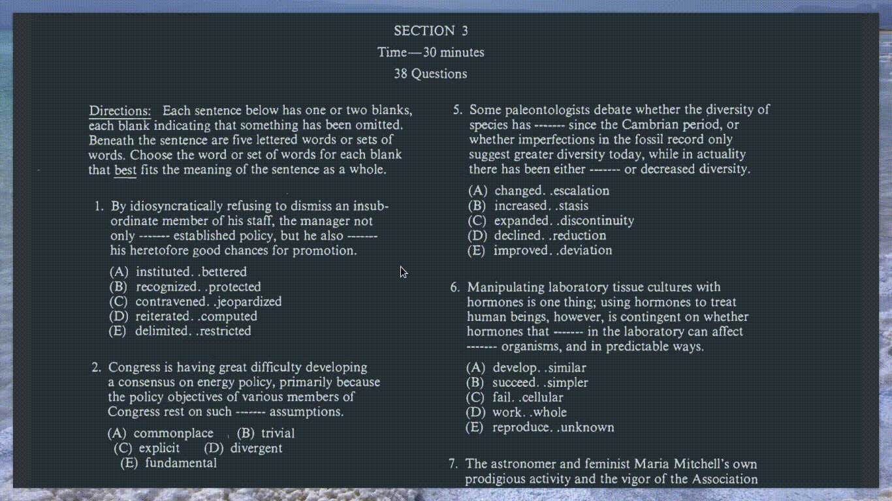

## GRE applet

GRE practice test companion. Keep track of your progress and where you spend time the most.

Demo


Dependencies:
- python and PySimpleGUI library 

Installation (Mac/Linux)
- first, install the gui library
    ```
sudo pip install PySimpleGui
    ```
You may or may not require `sudo`.
- clone the repo
    ```
git clone https://github.com/bibek22/gre-applet.git
    ```
- `cd` into the directory
    ```
cd gre-applet
    ```
- run the app
```
./button.py
```


Features:
- clean, unobstrusive GUI
- keeps track of time you spent on each question
- reads in correct answers once the test is done and shows result
- tabulated results
- allows anotating results
- logs report on to a file
- can answer with multiple answer choices (use input field)

Missing:
- haven't tested on Windows
- feature to flag questions

FAQ:
- How do I pick more than one options for a question?
Buttons only allow picking one option at a time. But, you can use the input field. Just type `ABC` on it if you want to choose `A`, `B` and `C` options.
Make sure you put a parenthesis around `ABC` while giving the answer at the end so that it counts as one response.
like so: `(ABC)`

Also notice that the counter helps you keep track of how many answer keys you've entered and the counter increases by $1$ once you close the parenthesis.
